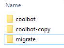

# Migrating data from Enmap 3


You do not need this page if you're new to Enmap or if you're starting a new project!


Upgrading to enmap v4 requires a little bit of migration, as Enmap 4 changed the internal method by which data is stored, slightly. To use this migration:

* Make a copy of your current app in a new folder.
* Create a new folder "on the same level" as your bot. Name it something like "migrate"
* You should now have 3 folders. Something like `mybots/coolbot` , `mybots/coolbot-copy` , `mybots/migrate/`
* In the `migrate` folder, run `npm i enmap@3.1.4 enmap-sqlite@latest` , as well as whatever source provider you need if it's not sqlite \(in my example, `npm i enmap-mongo@latest`

You should now have something like the following image.



In the `migrate` folder, create an `index.js` and use the following script for migration. Note that it's an example, change the provider option to fit what you're actually using.

```javascript
const Enmap = require("enmap");
const Provider = require("enmap-mongo");
const SQLite = require("enmap-sqlite");

let options = { 
  name: "test",
  user: "username",
  host: "yourhost",
  collection: "enmap",
  password: "password",
  port: 55258
};

const source = new Provider(options); 
const target = new SQLite({"name": "test", dataDir: '../coolbot-copy/data'});
Enmap.migrate(source, target).then( () => process.exit(0) );
```

Very important: the "target" **must** be enmap-sqlite. Enmap v4 only supports an sqlite-backend.

From the `migrate` folder, run `node index.js`, which should correctly migrate your data.

### Simpler migration from enmap-sqlite

If you're using enmap-sqlite already, you don't really need to do the entire thing above. Adding a single file called `migrate.js` to your project folder, then running it with `node migrate.js` will convert the format and then all you need is to modify the code for Enmap 4. Stilll, I recommend backing up your bot first. Just in case.

```javascript
const Enmap = require("enmap");
const SQLite = require("enmap-sqlite");

const source = new SQLite({"name": "test"});
const target = new SQLite({"name": "test"});
Enmap.migrate(source, target).then( () => process.exit(0) );
```

## Code Changes

There is _very little_ you need to change when moving to Enmap 4. The only changes that are required after migrating is the initialization of your Enmap which is now simpler.

```javascript
// Change From: 
const Enmap = require("enmap");
const Provider = require("enmap-mongo");

client.points = new Enmap({provider: new Provider({name: "points", url: "blah"});

// Change To: 
const Enmap = require("enmap");
client.points = new Enmap({name: "points"});
```

If using Enmap.multi\(\), the change is just as simple:

```javascript
// Change from V3:  
const Enmap = require("enmap");
const Provider = require("enmap-mongo");

Object.assign(client, Enmap.multi(["settings", "tags"], Provider, { url: "blah" }));

// Change to V4: 
const Enmap = require("enmap");
Object.assign(client, Enmap.multi(["settings", "tags"]));
```

The rest of your code \(all interactions with Enmap\) can remain the same - there should be no need to edit any of it.

## Installing V4

Once your data is migrating and the code is changed, you can go ahead and install enmap version 4 through `npm i enmap@latest` in your "new" bot folder \(the target of the migration\). This will take a few minutes \(it needs to rebuild sqlite\) and output that 4.0.x is now installed. Start the bot, and it should be working! If it doesn't, join the support server and we'll help you out ^\_^.

